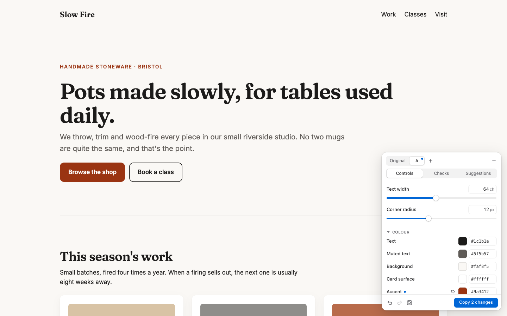
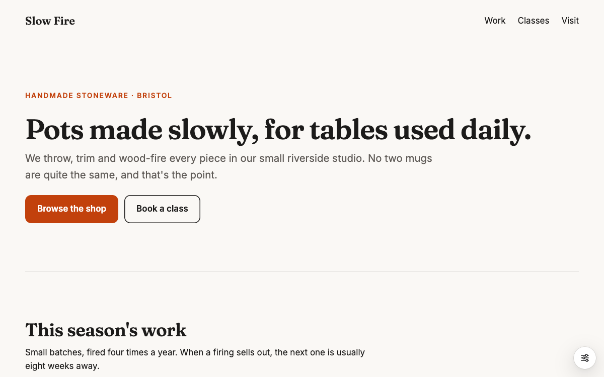
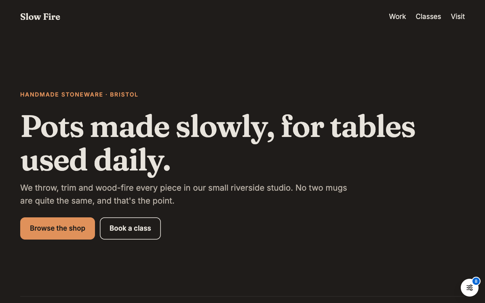
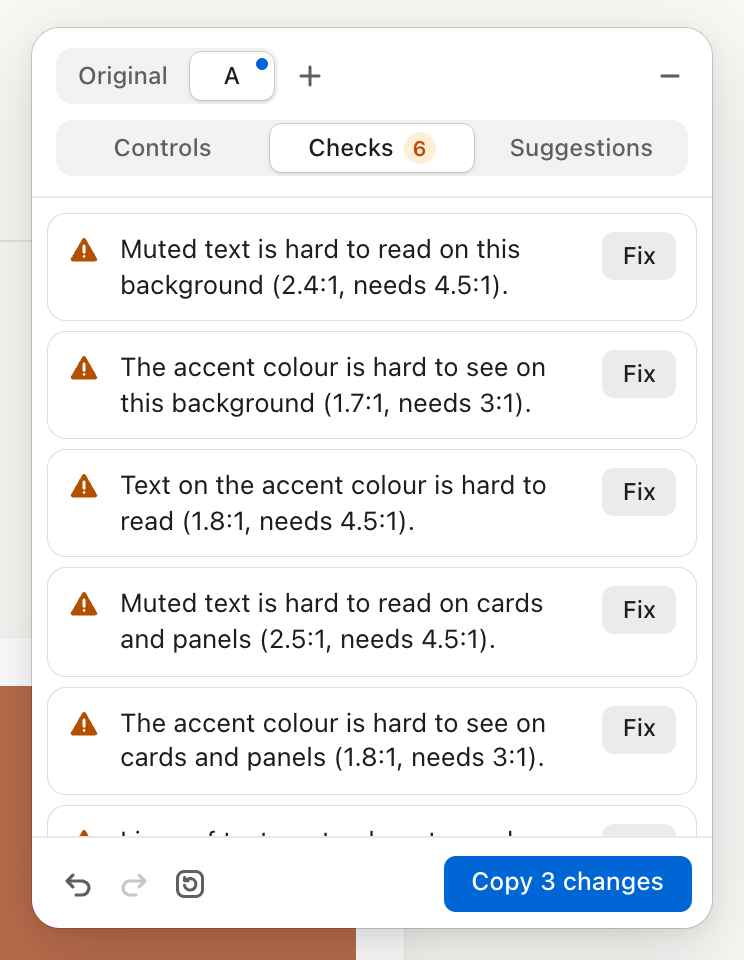
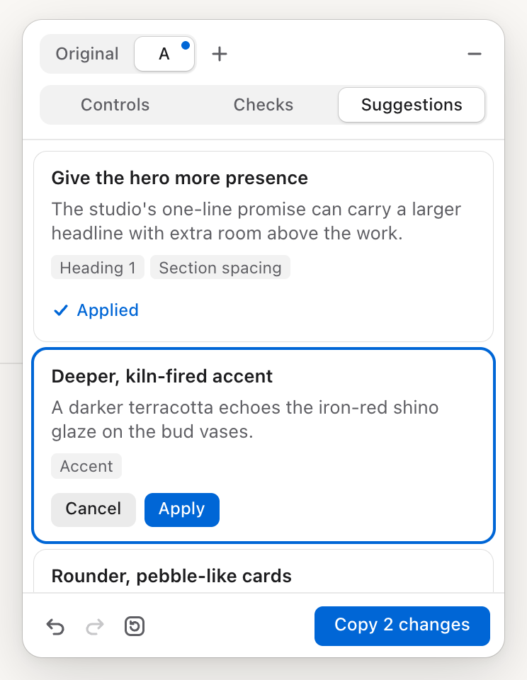
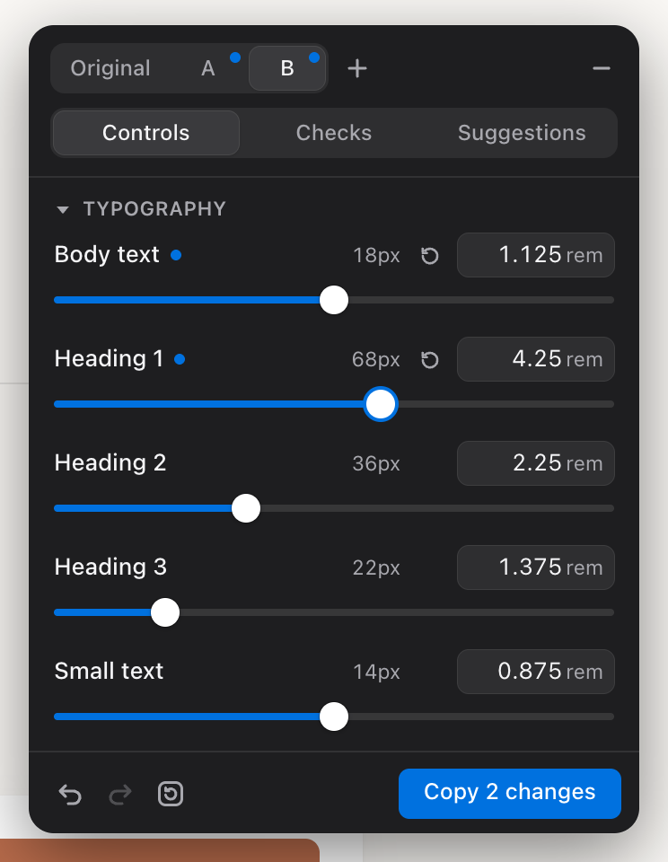

# Design Tweaker

**Stop describing design changes to Claude. Drag them.**

Design Tweaker is a Claude Code skill and a tiny in-browser panel. Claude builds your site with every design value as a live token, and puts a panel in the corner of the page with sliders, colour pickers, design checks and tailored suggestions. You tune the design by eye, click **Copy changes**, paste the result into Claude Code, and the edits go straight into your source.



---

## Why

Fine-tuning an AI-built site through chat goes like this:

> "Make the heading a bit bigger."  
> "No, smaller than that."  
> "Can the orange be a bit more… burnt?"  
> "Actually, go back to what it was two tries ago."

Every round trip means waiting, re-reading a diff and reloading the page. Visual adjustments belong on a slider, not in a prompt.

With Design Tweaker you:

- **See it instantly.** Every change repaints the page as you drag. There's no rebuild and no waiting.
- **Stay in control.** Nothing touches your code until you paste the changes back. Try a direction, hate it, undo.
- **Get exact edits.** Claude receives a precise block (`--text-h1: 3.75rem;`), not "a bit bigger". It updates those values and nothing else.

## How it works

1. **Ask Claude Code to build or restyle a site**, as you normally would. The skill triggers on its own.
2. **Claude builds on a token contract.** Every adjustable size, spacing and colour becomes a CSS variable in one place. Claude also writes a small config and installs the panel for development only.
3. **Open the site.** The panel sits in the bottom-right corner. Drag, pick, try versions, fix what the checks flag.
4. **Click Copy changes and paste into Claude Code:**
   ````
   ```design-tweaks
   Apply these design tweaks (design-tweaker v1)
   version: B
   tokens-file: src/index.css
   --text-h1: 3.75rem;
   --space-section: 112px;
   --color-accent: #b4380a;
   ```
   ````
5. **Claude updates your tokens.** The panel resyncs and shows **0 changes**, because your code now matches what you designed. With Vite and Next.js this happens by itself; with plain HTML, reload the page.
6. **Say "the design is final"**, and Claude removes the panel and its config and keeps your clean tokens.

## What's in the panel

### Live controls
Sliders and number inputs for type sizes, line heights, text width, section spacing, gaps and corner radius, plus colour pickers with hex input. Changed values get a blue dot and a one-click reset. Every change can be undone (⌘Z / ⌘⇧Z), and a whole slider drag is a single undo step.

### Versions: try A, B and C and flick between them
Hit **+** to branch a new version from the one you're on. Flick between **Original · A · B · C** instantly (⌥⇧1–4), with nothing reloaded. Each version keeps its own undo history, and all of them survive a page refresh. Here's the same page as the original and as a bolder Version B, without touching the code:

<table>
<tr>
<td></td>
<td></td>
</tr>
<tr><td align="center"><sub>Original</sub></td><td align="center"><sub>Version B</sub></td></tr>
</table>

### Design checks with one-click fixes
Fourteen rules run as you tweak: text contrast on the page and on cards (WCAG), accent visibility, text on buttons, line length, body text size, line height and heading hierarchy. Most have a **Fix** button that makes the smallest change that solves the problem. Contrast fixes keep the colour's hue and change only its lightness, and fixes never fight each other. A 5,000-design stress test clears every colour warning in five clicks or fewer.

### Suggestions written for *your* site
When Claude builds the site, it also writes 3–5 design ideas specific to it, like "Deeper, kiln-fired accent: a darker terracotta echoes the iron-red glaze on the bud vases". **Preview** one on the live page, then **Apply** or **Cancel**. Suggestions you've already gone past step aside. Nothing is final until you copy.

<table>
<tr>
<td></td>
<td></td>
<td></td>
</tr>
<tr><td align="center"><sub>Checks</sub></td><td align="center"><sub>Suggestions</sub></td><td align="center"><sub>Dark mode</sub></td></tr>
</table>

## Install

The skill lives in [`skill/design-tweaker`](skill/design-tweaker). Put it in your Claude Code skills folder:

```sh
git clone https://github.com/TomBlanks/styledial.git
mkdir -p ~/.claude/skills
cp -R styledial/skill/design-tweaker ~/.claude/skills/
```

(Use `ln -s` instead of `cp -R` if you'd like updates to the clone to apply automatically.)

That's it. There's nothing to add to your projects by hand; Claude installs the panel when it builds a site.

## Use it

Just ask for a website:

> Build a landing page for "Tally", a budgeting app for couples, using React with Vite and Tailwind CSS v4.

> Restyle this site so it feels calmer and more modern. Keep the content the same.

Then open the site in development, tweak, copy, paste. When you're happy:

> The design is final.

| Shortcut | Action |
|---|---|
| ⌥⇧T | Open / minimise the panel |
| ⌥⇧1 / 2 / 3 / 4 | Show Original / A / B / C |
| ⌘Z / ⌘⇧Z | Undo / redo (while the panel has focus) |
| Esc | End a suggestion preview |

## Works with

| Stack | Panel runs | In production |
|---|---|---|
| Plain HTML/CSS | Always, until you say the design is final | Removed by Claude when final |
| React + Vite | `npm run dev` only | **Not shipped**: Vite strips it |
| Next.js (App Router) | `next dev` only | **Not shipped**: no panel code in `next build` output |

Each works with or without **Tailwind CSS v4**. Tokens go in `@theme static`, so Tailwind utilities like `bg-accent` and `text-h1` stay live.

## Built to stay out of the way

- **Development only.** Automated tests check that production builds contain no panel element, no panel code and no config.
- **Can't break your styles.** The panel lives in a Shadow DOM. It was tested against deliberately hostile site CSS: site styles can't reach it, and its styles can't reach your site.
- **Never touches your elements.** Changes go into one unlayered `<style>` element that beats Tailwind's layered theme and plain `:root` blocks. That's it.
- **Tiny and dependency-free.** One 17.8 KB (gzipped) script with no runtime dependencies. Claude copies it byte for byte.
- **Accessible.** It's fully keyboard operable, follows the WAI-ARIA tabs pattern and respects reduced motion. An axe-core scan finds no WCAG 2.2 A/AA issues in light or dark mode.
- **Your tweaks persist.** Versions are saved per project in `localStorage` and reconciled with your code on every load, so an applied version drops to 0 changes while your other versions stay put.

## Repository layout

```
panel/      The panel: TypeScript source, esbuild build, 164 Vitest unit tests
skill/      The Claude Code skill: SKILL.md, references, and the built panel
examples/   Plain HTML, React + Vite + Tailwind, and Next.js + Tailwind sites
e2e/        21 Playwright tests across all three examples (dev + production)
docs/       README images
```

## Development

```sh
cd panel
npm install
npm test            # unit tests
npm run typecheck
npm run build       # → dist/tweak-panel.js, copied into the skill and every example
```

Run the examples:

```sh
open examples/plain-html/index.html
cd examples/react-vite-tailwind && npm install && npm run dev
cd examples/nextjs-tailwind && npm install && npm run dev
```

End-to-end tests (uses your installed Chrome; run `npm install` in each example first):

```sh
cd e2e && npm install && npm test
```

## Status and what's next

**v1 is complete.** It meets every acceptance criterion in the [spec](design-tweaker-spec.md). Every place the build departs from the spec, and why, is written down in [DECISIONS.md](DECISIONS.md).

On the roadmap:
- **Apply directly to files**, so there's no copy and paste.
- **Side-by-side compare** of two versions.
- **Font pairing** in the panel (for now, ask Claude in chat).
- **More versions**, **inspect mode** and **pinned notes**.
