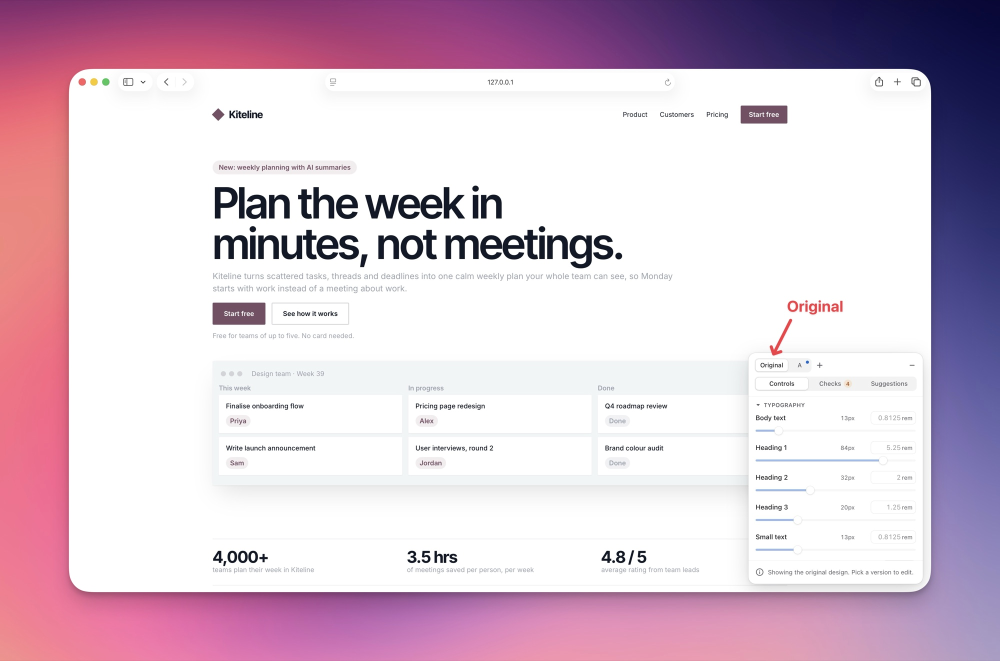
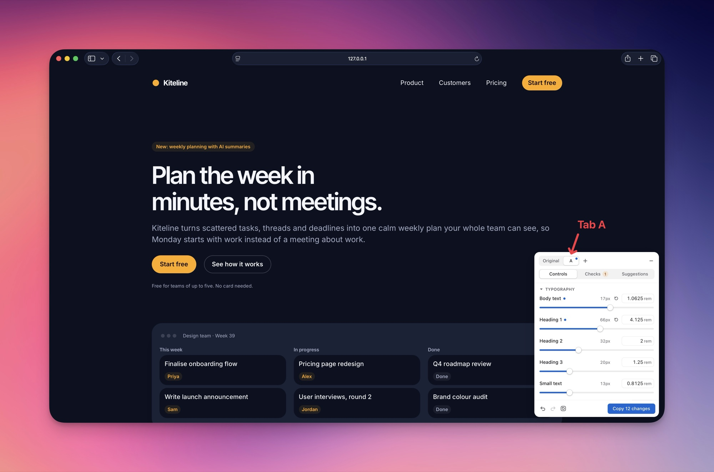
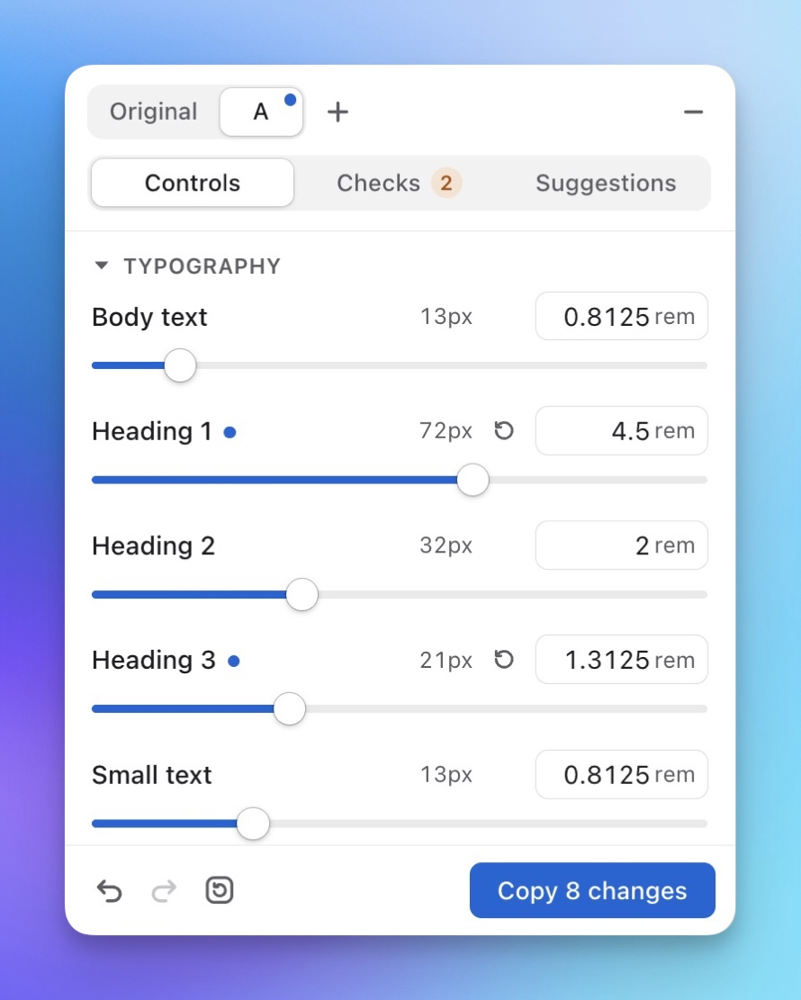
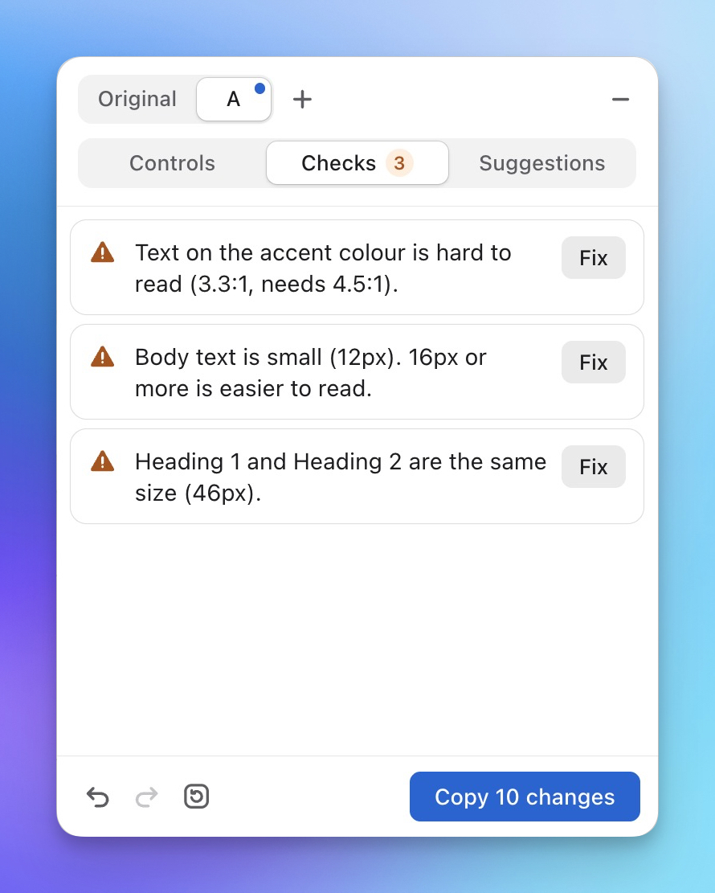
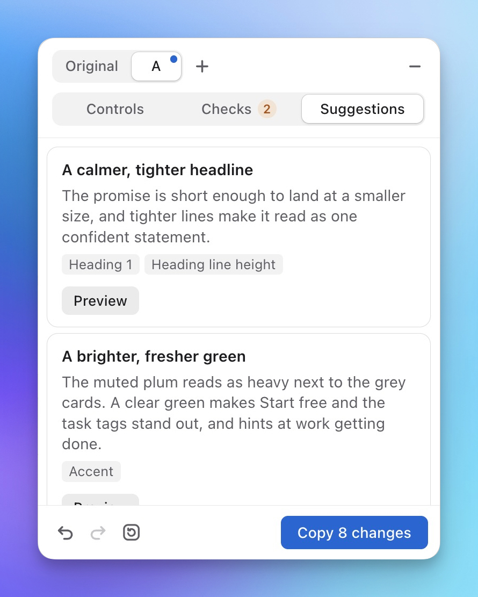

# Style Dial

[](https://github.com/TomBlanks/style-dial/actions/workflows/ci.yml)
[](LICENSE)


**Stop describing design changes to Claude. Drag them.**

Style Dial is a Claude Code skill and a tiny in-browser panel. Claude builds your site with every design value as a live token, and puts a panel in the corner of the page with sliders, colour pickers, design checks and tailored suggestions. You tune the design by eye, click **Copy changes**, paste the result into Claude Code, and the edits go straight into your source.

**[▶ Try the live demo](https://tomblanks.github.io/style-dial/)**, no install needed.

https://github.com/user-attachments/assets/e4bc497f-1424-4560-87b0-5d33f856382d

---

## Why

Fine-tuning an AI-built site through chat goes like this:

> "Make the heading a bit bigger."  
> "No, smaller than that."  
> "Can the orange be a bit more… burnt?"  
> "Actually, go back to what it was two tries ago."

Every round trip means guessing which change will make it look better, re-prompting, waiting and reloading the page. Visual adjustments belong on a slider, not in a prompt.

With Style Dial you:

- **See it instantly.** Every change repaints the page as you drag. There's no rebuild and no waiting.
- **Stay in control.** Nothing touches your code until you paste the changes back. Try a direction, hate it, undo.
- **Get exact edits.** Claude receives a precise block (`--text-h1: 3.75rem;`), not "a bit bigger". It updates those values and nothing else.

## How it works

1. **Ask Claude Code to build or restyle a site**, as you normally would. The skill triggers on its own.
2. **Claude builds on a token contract.** Every adjustable size, spacing and colour becomes a CSS variable in one place. Claude also writes a small config and installs the panel for development only.
3. **Open the site.** The panel sits in the bottom-right corner. Drag, pick, try versions, fix what the checks flag.
4. **Click Copy changes and paste into Claude Code:**
   ````
   ```style-tweaks
   Apply these style tweaks (style-dial v1)
   version: B
   tokens-file: src/index.css
   --text-h1: 3.75rem;
   --space-section: 112px;
   --color-accent: #b4380a;
   ```
   ````
5. **Claude updates your tokens.** The panel resyncs and shows **0 changes**, because your code now matches what you designed. With Vite and Next.js this happens by itself; with plain HTML, reload the page.
6. **Say "the design is final"**, and Claude removes the panel and its config and keeps your clean tokens.

## What's in the panel

### Live controls
Sliders and number inputs for type sizes, line heights, text width, section spacing, gaps and corner radius, plus colour pickers with hex input. Changed values get a blue dot and a one-click reset. Every change can be undone (⌘Z / ⌘⇧Z), and a whole slider drag is a single undo step.

### Versions: try A, B and C and flick between them
Hit **+** to branch a new version from the one you're on. Flick between **Original · A · B · C** instantly (⌥⇧1–4), with nothing reloaded. Each version keeps its own undo history, and all of them survive a page refresh. Here's the same page in two different styles, on two tabs (Original and A), without touching the code:

<table>
<tr>
<td></td>
<td></td>
</tr>
<tr><td align="center"><sub>Original</sub></td><td align="center"><sub>Version A</sub></td></tr>
</table>

### Design checks with one-click fixes
Fourteen rules run as you tweak the design: text contrast on the page and on cards, accent visibility, text on buttons, line length, body text size, line height and heading hierarchy. Most have a **Fix** button that makes the smallest change that solves the problem. Contrast fixes keep the colour's hue and change only its lightness, and fixes never fight each other.

### Suggestions written for *your* site
When Claude builds the site, it also writes 3–5 design ideas specific to it, like "A brighter, fresher green: the muted plum reads as heavy next to the grey cards". **Preview** one on the live page, then **Apply** or **Cancel**. Nothing is final until you copy.

<table>
<tr>
<td width="33%"></td>
<td width="33%"></td>
<td width="33%"></td>
</tr>
<tr><td align="center"><sub>Controls</sub></td><td align="center"><sub>Checks</sub></td><td align="center"><sub>Suggestions</sub></td></tr>
</table>

## Install

The skill lives in [`skill/style-dial`](skill/style-dial). Put it in your Claude Code skills folder:

```sh
git clone https://github.com/TomBlanks/style-dial.git
mkdir -p ~/.claude/skills
cp -R style-dial/skill/style-dial ~/.claude/skills/
```

(Use `ln -s` instead of `cp -R` if you'd like updates to the clone to apply automatically.)

That's it. There's nothing to add to your projects by hand; Claude installs the panel when it builds a site.

## Use it

Just ask for a website:

> Build a landing page for "Tally", a budgeting app for couples, using React with Vite and Tailwind CSS v4.

> Restyle this site so it feels calmer and more modern. Keep the content the same.

Then open the site in development, tweak, copy, paste. When you're happy:

> The design is final.

| Shortcut | Action |
|---|---|
| ⌥⇧T | Open / minimise the panel |
| ⌥⇧1 / 2 / 3 / 4 | Show Original / A / B / C |
| ⌘Z / ⌘⇧Z | Undo / redo (while the panel has focus) |
| Esc | End a suggestion preview |

## Works with

| Stack | Panel runs | In production |
|---|---|---|
| Plain HTML/CSS | Always, until you say the design is final | Removed by Claude when final |
| React + Vite | `npm run dev` only | **Not shipped**: Vite strips it |
| Next.js (App Router) | `next dev` only | **Not shipped**: no panel code in `next build` output |

Each works with or without **Tailwind CSS v4**. Tokens go in `@theme static`, so Tailwind utilities like `bg-accent` and `text-h1` stay live.

## Why I built it

I was building my personal website with Claude. I knew exactly how I wanted it to look, but Claude kept getting the spacing and typography slightly wrong, and every correction meant another prompt, another wait, and another result that still wasn't quite right. The real problem was the back-and-forth: it takes many rounds for a designer and Claude to agree on what "a bit more space" means.

Style Dial cuts out that loop. You adjust the design by eye, see it instantly, and hand Claude the exact values to write. It works with any HTML and CSS project instead of locking you into a site builder like Squarespace, so once the design is right you carry on with Claude as a developer normally would. Style Dial just handles the fiddly part.

### What was hard

- **Fixes that fought each other.** Fixing body text against the page could break it against the cards, and fixing that broke the first one again, in an endless loop. I reproduced 56 looping combinations, then rewrote every colour fix to share one search that satisfies all of a colour's pairs at once. Now 5,000 random designs all settle in five clicks or fewer.
- **Powerful but uncluttered.** The panel needed versions, checks, suggestions and undo, but it had to fit in a corner of the screen and stay easy to use. I removed the title row, moved the change count into the Copy button, and left font controls out of v1 rather than cram them in.
- **Assumptions that didn't hold.** Testing against real frameworks showed that Tailwind v4 silently drops theme variables no utility uses, which left some sliders doing nothing, and that the recommended Next.js setup shipped the dev-only panel in production builds. Both are fixed and covered by end-to-end tests.
- **Trying it on real sites.** I ran the skill on four trial builds: a portfolio, a landing page, a business site and a restyle. They exposed gaps the spec had missed, such as captions that were unreadable on coloured cards, which led to two new checks.

## Limitations

- **Claude Code only.** The skill relies on Claude Code editing files in your project.
- **Copy and paste.** Browsers can't write to your source files, so changes go back through Claude. Applying them directly is on the roadmap.
- **Tokens, not layouts.** The panel adjusts sizes, spacing, radii and colours. Structural changes still happen in chat.
- **No font control yet.** Ask Claude for font changes in chat for now.

<details>
<summary><strong>Repository layout</strong></summary>

```
panel/      The panel: TypeScript source, esbuild build, 165 Vitest unit tests
skill/      The Claude Code skill: SKILL.md, references, and the built panel
examples/   Plain HTML, React + Vite + Tailwind, and Next.js + Tailwind sites, plus the live demo
e2e/        21 Playwright tests across all three examples (dev + production)
docs/       README images
```

</details>

## Status and what's next

**v1 is complete.**

On the roadmap:
- **Apply directly to files**, so there's no copy and paste.
- **Side-by-side compare** of two versions.
- **Font pairing** in the panel (for now, ask Claude in chat).
- **More versions**, **inspect mode** and **pinned notes**.

## License

[MIT](LICENSE)
